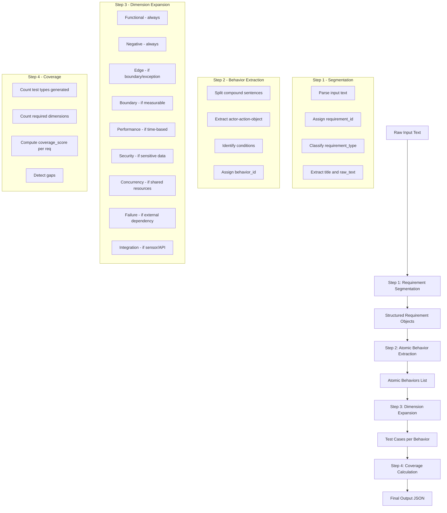

# Structured Test Case Extraction Pipeline — Implementation Plan

## Overview

Upgrade the existing test case generator to implement the full **extraction pipeline** as specified in the guide: Requirement Segmentation → Atomic Behavior Extraction → Dimension Expansion → Structured Test Case Output with coverage tracking.

## Current State vs Target State

| Aspect | Current | Target |
|--------|---------|--------|
| Requirement types | Functional, Validation, Business rule, Security, Performance, API, UI/UX | + NFR, Edge, Risk, Assumption, Metric |
| Test types | Positive, Negative, Edge, Boundary, Security, API | + Functional, Performance, Concurrency, Failure, Integration |
| Atomic behaviors | Not implemented | Full actor-action-object decomposition |
| Dimension expansion | Fixed 4 types per requirement | 9-dimension matrix per behavior |
| Coverage tracking | Basic percentage | Per-requirement coverage_score |
| Output structure | requirements + test_cases | + behaviors + coverage_summary |
| Enterprise rules | None | Min 3 types/FR, payment/concurrency/NFR rules |

## Pipeline Architecture



## File Changes

### 1. `schemas.py` — Model Updates

- Add `AtomicBehavior` model: `behavior_id`, `requirement_id`, `actor`, `action`, `object_name`, `condition`, `description`
- Extend `REQUIREMENT_CLASSIFICATION_TYPES` Literal
- Extend `TEST_CASE_TYPES` Literal to include all 9 dimensions
- Add `behavior_id`, `confidence`, `validation_type` to `TestCase`
- Add `CoverageSummary` model
- Update `TestCaseGeneratorOutput` to include `behaviors` and `coverage_summary`

### 2. New Service: `behavior_extraction.py`

- `BehaviorExtractionService.extract()` — takes a normalized requirement, returns list of `AtomicBehavior`
- Compound sentence splitting logic
- Actor-action-object decomposition using NLP patterns
- Behavior ID generation: `{REQ_ID}-B{N}`

### 3. `normalization.py` — Updates

- Add `requirement_type` field to `NormalizationResult`
- Classify into: Functional, NFR, Edge, Risk, Assumption, Metric

### 4. `generation.py` — Major Overhaul

- Replace fixed 4-type generation with 9-dimension expansion matrix
- Add `DimensionApplicabilityEngine` — determines which dimensions apply per behavior
- Add enterprise rule enforcement
- Generate `behavior_id`, `confidence`, `validation_type` per test case

### 5. New Service: `coverage.py`

- `CoverageService.calculate()` — computes per-requirement coverage
- Formula: `test_types_generated / required_dimensions`
- Gap detection and reporting

### 6. `main.py` — Pipeline Integration

- Insert behavior extraction between normalization and generation
- Pass behaviors to generation service
- Include behaviors and coverage_summary in output
- Update API response format

### 7. Tests

- `test_behavior_extraction.py` — atomic behavior extraction
- `test_dimension_expansion.py` — dimension expansion and coverage

### 8. Frontend `App.js`

- Display atomic behaviors section
- Display coverage summary with per-requirement scores
- Visual coverage indicators

## Output Schema Target

```json
{
  "requirements": [...],
  "behaviors": [...],
  "test_cases": [...],
  "coverage_summary": {
    "FR-1": 85,
    "FR-2": 90,
    "FR-3": 100
  }
}
```
