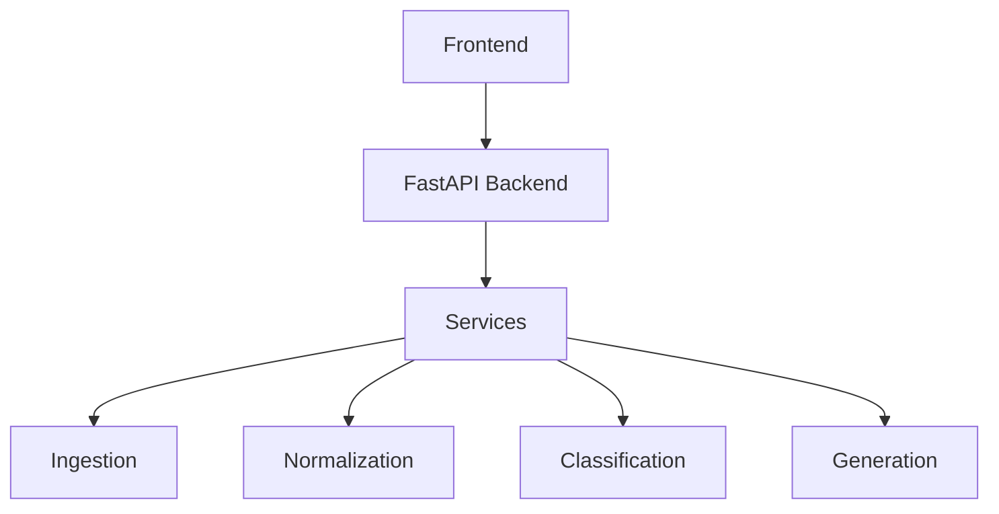

# Test Case Generator - UI and Functionality Upgrade Plan

## Overview
Upgrade the Test Case Generator application with modern UI and enhanced functionalities while maintaining backward compatibility with the current working state.

## Current Architecture

---

## Phase 1: UI Modernization

### 1.1 Modernize index.html (Static UI)
**File**: `test-case-generator/frontend/index.html`

| Priority | Feature | Description |
|----------|---------|-------------|
| High | Tailwind CSS | Replace inline styles with Tailwind CSS for maintainability |
| High | Dark Mode | Add light/dark theme toggle |
| Medium | Responsive Design | Ensure mobile/tablet compatibility |
| Medium | Loading Animations | Add progress spinner and skeleton loaders |
| Medium | Toast Notifications | Replace alerts with toast notifications |

**Action Items:**
- [ ] Integrate Tailwind CSS via CDN
- [ ] Create CSS variables for theming (light/dark)
- [ ] Add responsive grid layouts
- [ ] Implement loading states with animations
- [ ] Add toast notification system

### 1.2 Enhance React App.js
**File**: `test-case-generator/frontend/src/pages/App.js`

| Priority | Feature | Description |
|----------|---------|-------------|
| High | Component Refactoring | Extract inline components to separate files |
| High | State Management | Add React Context or state hooks for better state handling |
| Medium | Search/Filter | Add search and filter functionality for test cases |
| Medium | Test Case Details Modal | View test case details in modal instead of expanding |
| Low | Drag & Drop | Reorder test cases via drag and drop |

**Action Items:**
- [ ] Create separate component files (TestCaseCard, RequirementCard, StatCard)
- [ ] Implement search/filter functionality
- [ ] Add test case detail modal
- [ ] Implement keyboard shortcuts

---

## Phase 2: Enhanced Functionalities

### 2.1 Advanced Export Options
**File**: `test-case-generator/frontend/index.html` + `backend/main.py`

| Priority | Feature | Description |
|----------|---------|-------------|
| High | TestRail Export | Export to TestRail JSON format |
| High | JIRA Export | Export to JIRA/Xray format |
| Medium | Excel Export | Export to Excel (.xlsx) format |
| Medium | PDF Export | Export to PDF format |

**Action Items:**
- [ ] Add TestRail format export endpoint
- [ ] Add JIRA/Xray format export endpoint
- [ ] Add Excel export using xlsx library
- [ ] Add PDF export using jspdf library

### 2.2 Batch Processing
**File**: `test-case-generator/frontend/index.html`

| Priority | Feature | Description |
|----------|---------|-------------|
| High | Multi-Requirement Input | Accept multiple requirements (one per line) |
| High | File Upload | Upload requirements from .txt, .docx, .pdf files |
| Medium | Progress Indicator | Show progress for batch processing |
| Medium | Results Grouping | Group test cases by requirement |

**Action Items:**
- [ ] Implement multi-line requirement input
- [ ] Add file upload for .txt, .docx, .pdf
- [ ] Add progress bar for batch processing
- [ ] Group and display results by source requirement

### 2.3 Test Case Management
**File**: `test-case-generator/frontend/index.html`

| Priority | Feature | Description |
|----------|---------|-------------|
| Medium | Edit Test Cases | Inline editing of generated test cases |
| Medium | Delete Test Cases | Remove unwanted test cases |
| Medium | Add Custom Steps | Add custom test steps |
| Medium | Clone Test Cases | Duplicate test cases for modification |

**Action Items:**
- [ ] Add inline editing for test case fields
- [ ] Implement delete functionality
- [ ] Add custom step functionality
- [ ] Implement clone functionality

---

## Phase 3: Backend Enhancements

### 3.1 API Enhancements
**File**: `test-case-generator/backend/main.py`

| Priority | Feature | Description |
|----------|---------|-------------|
| High | Export Endpoints | Add dedicated endpoints for each export format |
| Medium | Rate Limiting | Add rate limiting to prevent abuse |
| Medium | Caching | Add response caching for repeated requests |
| Low | Authentication | Add basic API key authentication |

**Action Items:**
- [ ] Create `/export/testrail` endpoint
- [ ] Create `/export/jira` endpoint
- [ ] Create `/export/excel` endpoint
- [ ] Add slowapi for rate limiting
- [ ] Add caching middleware

### 3.2 New Services
**Files**: `backend/services/`, `backend/api/`

| Priority | Feature | Description |
|----------|---------|-------------|
| Medium | Export Service | Dedicated service for format conversions |
| Medium | File Processing Service | Handle file uploads (docx, pdf) |
| Low | Auth Service | Handle API authentication |

**Action Items:**
- [ ] Create `export_service.py`
- [ ] Create `file_processing_service.py`
- [ ] Add docx and pdf parsing dependencies

---

## Phase 4: User Experience Improvements

### 4.1 Input Improvements
**File**: `test-case-generator/frontend/index.html`

| Priority | Feature | Description |
|----------|---------|-------------|
| High | Requirement Templates | Pre-built requirement templates |
| Medium | AI Suggestions | AI-powered requirement suggestions |
| Medium | Requirement Validation | Real-time validation of input |
| Low | Auto-save | Auto-save input to localStorage |

**Action Items:**
- [ ] Add common requirement templates dropdown
- [ ] Add requirement validation with visual feedback
- [ ] Implement localStorage auto-save
- [ ] Add example/helper text

### 4.2 Results Display
**File**: `test-case-generator/frontend/index.html`

| Priority | Feature | Description |
|----------|---------|-------------|
| High | Enhanced Statistics | More detailed analytics dashboard |
| Medium | Coverage Analysis | Show requirement-to-test coverage |
| Medium | Test Type Distribution | Visualize test type breakdown |
| Low | Export Preview | Preview export before downloading |

**Action Items:**
- [ ] Add coverage percentage indicator
- [ ] Add test type distribution chart
- [ ] Add requirement traceability matrix
- [ ] Add export preview modal

---

## Implementation Order

### Sprint 1: UI Foundation
1. Integrate Tailwind CSS
2. Add dark mode support
3. Implement responsive design
4. Add loading animations
5. Add toast notifications

### Sprint 2: Enhanced Exports
1. Add TestRail export format
2. Add JIRA/Xray export format
3. Add Excel export format
4. Create export service
5. Update API endpoints

### Sprint 3: Batch & File Processing
1. Implement multi-line input
2. Add file upload functionality
3. Add progress indicator
4. Group results by requirement
5. Create file processing service

### Sprint 4: Test Case Management
1. Implement inline editing
2. Add delete functionality
3. Add custom steps
4. Implement clone functionality
5. Add auto-save feature

### Sprint 5: Analytics & Experience
1. Enhanced statistics dashboard
2. Coverage analysis
3. Test type distribution charts
4. Export preview
5. Requirement templates

---

## Files to Modify

### Frontend
- `test-case-generator/frontend/index.html` - Complete UI overhaul
- `test-case-generator/frontend/src/pages/App.js` - Enhanced React app

### Backend
- `test-case-generator/backend/main.py` - New API endpoints
- `test-case-generator/backend/services/export_service.py` - New export service (create)
- `test-case-generator/backend/services/file_processor.py` - New file processor (create)

### Dependencies to Add
- Frontend: Tailwind CSS, xlsx, jspdf, file-saver
- Backend: python-multipart, python-docx, python-pdf

---

## Backward Compatibility
All changes maintain backward compatibility:
- Existing API endpoints remain unchanged
- Existing export formats (JSON, CSV, Markdown) continue to work
- Frontend can work without JavaScript enabled (basic functionality)
